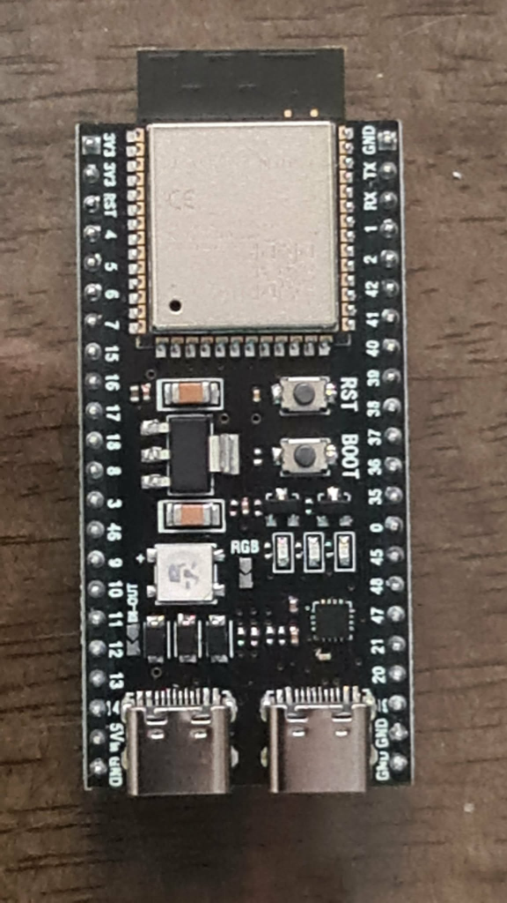
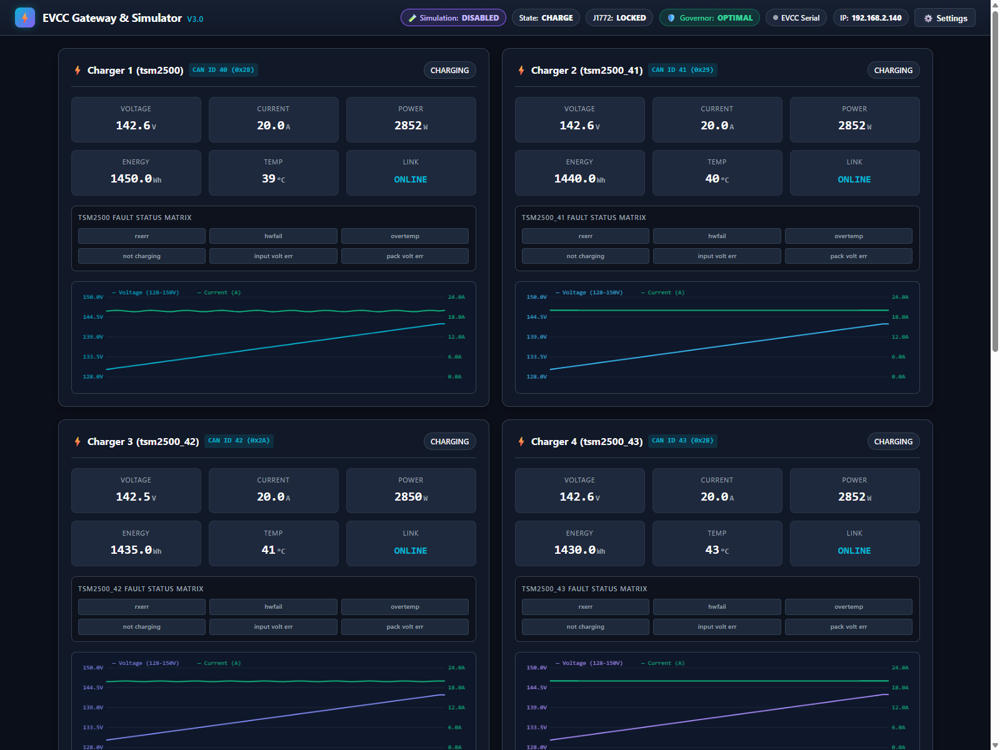
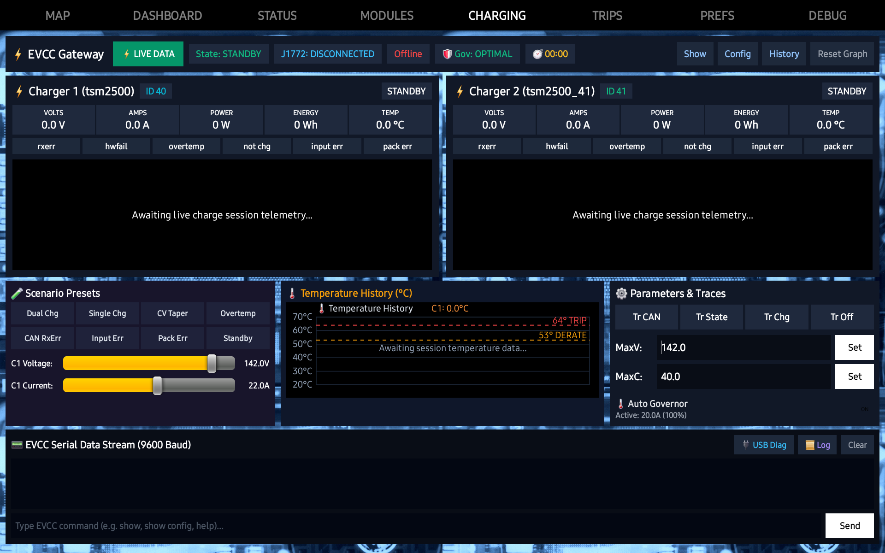

# Thunderstruck EVCC Serial-to-WiFi Gateway

An advanced, open-source firmware for the **ESP32-S3** (specifically dual USB-C development boards such as the **YD-ESP32-S3**) that bridges a **Thunderstruck EVCC v3.0** Electric Vehicle Charge Controller to a real-time web dashboard, high-rate WebSocket telemetry, and zero-configuration UDP subnet broadcasts over Wi-Fi.

Built for custom electric vehicle conversions, digital dashboards, and automated charging stations.

---

## Table of Contents
- [Overview](#overview)
- [Key Features](#key-features)
- [Hardware & Pinout](#hardware--pinout)
  - [Port Layout & Roles](#port-layout--roles)
  - [The USB-OTG Solder Jumper (Crucial)](#the-usb-otg-solder-jumper-crucial)
  - [USB-C Power Delivery Note (USB-A vs USB-C Cable)](#usb-c-power-delivery-note)
  - [Optional Direct TTL Connection](#optional-direct-ttl-connection)
- [Wiring & Connection Diagrams](#wiring--connection-diagrams)
- [Status LED Indications](#status-led-indications)
- [Thermal Governor v3.0](#thermal-governor-v30)
  - [Dynamic Current Throttling](#dynamic-current-throttling)
  - [4°C Hysteresis Guard](#4c-hysteresis-guard)
  - [90-Second Dwell Stabilization Timer](#90-second-dwell-stabilization-timer)
- [Subnet UDP Broadcast Protocol (Port 8888)](#subnet-udp-broadcast-protocol-port-8888)
- [Web Dashboard & Controls](#web-dashboard--controls)
- [Standalone Android Companion App](#standalone-android-companion-app)
- [First-Time WiFi Setup & Web Portal](#first-time-wifi-setup--web-portal)
- [REST API & WebSocket Protocol](#rest-api--websocket-protocol)
- [Persistent Flash Event Logging](#persistent-flash-event-logging)
- [Building and Flashing](#building-and-flashing)
- [Troubleshooting & Diagnostics](#troubleshooting--diagnostics)
- [License](#license)

---

## Overview

The **Thunderstruck EVCC** (Electric Vehicle Charge Controller) manages EV charging via J1772 pilot communication and controls one or more CANbus chargers (such as the Thunderstruck / Elcon TSM-2500). The EVCC outputs telemetry and accepts configuration commands through a 9600-baud serial port via a 3.5mm jack.

This project turns an inexpensive **ESP32-S3** board into an intelligent gateway that:
1. Connects to the EVCC via USB Host OTG (reading the FTDI chip inside the official EVCC cable).
2. Parses ASCII data streams and charger telemetry in real time.
3. Broadcasts structured JSON telemetry and raw console streams over WebSockets and UDP subnet broadcast.
4. Hosts a modern, responsive web dashboard with live auto-scaling charge histograms, status badges, fault flags, and parameter controls.
5. Implements a closed-loop **Thermal Governor** with hysteresis and dwell stabilization to safeguard chargers during heavy charge sessions.
6. Seamlessly integrates with in-vehicle companion displays (such as Android dashboards) via automatic UDP discovery.
7. Provides persistent offline flash logging so all vehicle sessions are safely stored and can be analyzed later.

---

## Key Features

- **USB Host OTG Serial (9600 Baud, 8N1)**: Native USB host stack reads the FTDI FT232R chip inside the official EVCC 3.5mm-to-USB cable with zero cable modifications.
- **Simultaneous Hardware UART Fallback**: Actively mirrors TX and listens to RX on **GPIO 18 (RX)** and **GPIO 17 (TX)** at 9600 baud for direct 3.3V TTL wiring if USB is not used.
- **Simultaneous Quad Charger Support (Up to 4 Chargers)**:
  - **Charger 1**: `charger` / `tsm2500` (CAN ID 40 / 0x28)
  - **Charger 2**: `charger2` / `tsm2500_41` (CAN ID 41 / 0x29)
  - **Charger 3**: `charger3` / `tsm2500_42` (CAN ID 42 / 0x2A)
  - **Charger 4**: `charger4` / `tsm2500_43` (CAN ID 43 / 0x2B) or `elcon`
  - Independently tracks **Voltage (V)**, **Current (A)**, **Power (W)**, **Energy (Wh)**, and **Temperature (°C)** across all units with aggregate charge wattage.
- **v3.0 Thermal Governor**:
  - Closed-loop dynamic current throttling based on real-time charger temperatures.
  - **4°C Hysteresis Guard** prevents continuous oscillating around trip thresholds.
  - **90-Second Dwell Stabilization Timer** ensures charger hardware thermally settles before current is restored.
  - Clear state reporting: `OPTIMAL`, `DERATE (50°C)`, `TRIP (60°C)`.
- **Subnet UDP Broadcast (Port 8888)**:
  - Continuous 1-second JSON telemetry broadcast on `255.255.255.255:8888`.
  - Zero-configuration auto-discovery: Client dashboards (tablets, car PCs) discover the gateway IP dynamically without manual IP entry.
- **Fault Detection Matrix**: Instant visual alerts per charger for EVCC/charger fault states:
  - `rxerr` (CAN communication error)
  - `hwfail` (Hardware failure)
  - `overtemp` (Overtemperature fault)
  - `not charging` (Charger idle or interrupted)
  - `input voltage err` (AC line input fault)
  - `pack voltage err` (DC pack voltage out of bounds)
- **Live Auto-Scaling Histograms**: Dynamically plots and overlays Voltage and Current for each charger over the session timeline, scaling both axes automatically.
- **Zero-Heap Gzip Web Streaming**: The rich web dashboard is stored gzipped in `PROGMEM` (~11.6 KB) and streamed directly out of flash memory byte-by-byte with zero heap allocation, eliminating out-of-memory panics.
- **Trace & Parameter Controls**:
  - Interactive toggles: `Trace CAN`, `Trace State`, `Trace Charger`, `Trace Off`.
  - In-browser value setters: `maxv` (Maximum Voltage), `maxc` (Maximum Current), `termc` (Termination Current).
  - Momentary buttons: inspect formatted responses for `show`, `show config`, and `show history`.
- **Raw Monospace Terminal**: Color-coded, auto-scrolling terminal with command line input and command history.
- **WiFi Network Management**:
  - Boots into Open SoftAP (`EVCC-Gateway-AP` at `192.168.4.1`) on first run or if the target network is unavailable.
  - Generous **1-minute connection timeout** (`STA_CONNECT_TIMEOUT_MS = 60000`) allows slow car routers, hotspots, and mesh nodes to complete association and DHCP leases.
  - **3-minute SoftAP stability guard** prevents repeated connection retries from interrupting mobile devices while configuring settings.
  - Captive Portal configuration modal with **👁️ Show / 🙈 Hide** unmask toggle for WiFi passwords and automatic pre-population of stored credentials.
  - Hold the onboard `BOOT` button (GPIO 0) for 5 seconds to factory-reset WiFi settings back to SoftAP mode.
- **Onboard WS2812 RGB Status LED**: Visual color-coded status indication (mode, connection, and data transfer).
- **Persistent Flash Event Logger**: Non-volatile LittleFS storage records boots, reset reasons, WiFi diagnostics, USB host detection states, and raw TX/RX data for offline diagnosis.

---

## Hardware & Pinout

This project targets the **ESP32-S3 Dual Type-C Development Board** (commonly known as the **YD-ESP32-S3** by VCC-GND Studio, or compatible DevKitC-1 clones).

<p align="center">
  
  <br>
  <em>Figure 1: YD-ESP32-S3 Board Layout showing Dual Type-C ports, onboard RGB LED, and buttons</em>
</p>

```
                  ┌──────────────────────┐
                  │   ESP32-S3 Module    │
                  │   [RST]     [BOOT]   │
                  │   [RGB]     [3.3V]   │
                  │                      │
                  │ [LEFT]        [RIGHT]│
                  │  USB           UART  │
                  └──────┬──────────┬────┘
                         │          │
        Native USB Host ─┘          └─ CH343P USB-to-UART
        (Connect to EVCC)              (Programming & 5V Power)
```

### Port Layout & Roles

| Connector | Port Name | Hardware Connection | Purpose |
| :--- | :--- | :--- | :--- |
| **LEFT Port** | **Native USB (USB-OTG)** | ESP32-S3 internal PHY: GPIO 19 (`D-`), GPIO 20 (`D+`) | **Connect to EVCC Cable.** This is the ONLY port with USB Host capability. |
| **RIGHT Port** | **UART (Serial Bridge)** | WCH CH343P chip: GPIO 43 (`TX0`), GPIO 44 (`RX0`) | **Connect to PC or 5V Power Supply.** Used for flashing firmware, viewing serial monitor logs, and powering the board. |

### The USB-OTG Solder Jumper (Crucial)

The Thunderstruck EVCC cable contains an FTDI FT232R USB-to-serial chip inside the USB-A plug. **This FTDI chip requires 5V power on its VBUS pin to operate.**

On the YD-ESP32-S3 board, the 5V power rails of the two USB ports are isolated by protection diodes. Powering the board via the right port will leave the left port's VBUS unpowered (0 Volts) by default.

#### Recommended Fix:
On the **back (underside) of the board**, locate the solder jumper pads labeled **`USB-OTG`** (on some board revisions near the `DI-OUT` label).
1. Bridge the two **`USB-OTG`** pads with a small drop of solder.
2. This connects the board's 5V rail directly to the LEFT port's VBUS line.
3. Now, whenever the board is powered through the RIGHT port (or the `5Vin` header pin), 5V is automatically supplied to the LEFT port to power the EVCC cable.

### USB-C Power Delivery Note

> [!WARNING]
> **Power Cable Requirement: Use a USB-A to USB-C Cable (Not USB-C to USB-C PD)**
> Like most low-cost ESP32 development boards, the Type-C UART receptacle omits the two 5.1 kΩ CC pulldown resistors. If you use a **USB-C to USB-C cable** connected to a smart USB-PD power bank or PD wall charger, the power supply will detect an open circuit and output **0V** (the board will not boot).
> 
> Always power the board using a **standard USB-A to USB-C cable** (from a standard 5V power source).

*Alternative without soldering:* Use a commercial **2-in-1 USB-C OTG Splitter Cable with Power Pass-Through** plugged directly into the left port.

### Optional Direct TTL Connection

If you do not want to use the USB cable and FTDI adapter, the EVCC 3.5mm jack provides standard 3.3V TTL serial:
- **3.5mm Tip (EVCC TX)** $\rightarrow$ Connect to **ESP32 GPIO 18 (RX)**
- **3.5mm Ring (EVCC RX)** $\rightarrow$ Connect to **ESP32 GPIO 17 (TX)**
- **3.5mm Sleeve (GND)** $\rightarrow$ Connect to **ESP32 GND**

The firmware actively transmits and listens on GPIO 18/17 simultaneously with the USB Host port.

---

## Wiring & Connection Diagrams

### Standard USB-OTG Setup

```
[Thunderstruck EVCC 3.0]
         │
         │ (3.5mm Serial Jack)
         ▼
[Thunderstruck USB Cable (FTDI)]
         │
         │ (USB-A Male)
         ▼
[USB-A to USB-C OTG Adapter]
         │
         │ (USB-C Male)
         ▼
[ESP32-S3 LEFT Connector (Native USB)]

[5V Power Supply] ──────────► [ESP32-S3 RIGHT Connector (UART)]
  (via USB-A to USB-C cable)  (Board has USB-OTG jumper bridged)
```

---

## Status LED Indications

The onboard addressable RGB LED (GPIO 48) indicates system state in real time:

| LED Color & Pattern | Meaning |
| :--- | :--- |
| **Solid Red** | Hardware error or Wi-Fi configuration error. |
| **Blinking Red** | SoftAP mode active (`EVCC-Gateway-AP`). Actively broadcasting for client connection. |
| **Blinking Yellow** | Connecting / transitioning to target Wi-Fi network (up to 60s timeout). |
| **Blinking Green** | Connected to target Wi-Fi network (idle / ready). |
| **Solid Green** | Actively receiving and transmitting EVCC serial telemetry over Wi-Fi. |

---

## Thermal Governor v3.0

The **Thermal Governor** protects dual or quad TSM-2500 chargers from thermal degradation during prolonged charging sessions.

```
                    ┌────────────────────────┐
                    │ Temperature Monitoring │
                    └───────────┬────────────┘
                                │
                 ┌──────────────┴──────────────┐
                 ▼                             ▼
        Charger 1 Temp                 Charger 2 Temp
                 └──────────────┬──────────────┘
                                │
                       Max Temp Evaluated
                                │
          ┌─────────────────────┼─────────────────────┐
          ▼                     ▼                     ▼
     <= 47°C               50°C - 59°C             >= 60°C
  [  OPTIMAL  ]         [ DERATE STAGE ]        [ TRIP / STOP ]
   100% Current          Graduated Derate          0A Cutoff
   (90s Dwell)           (3°C Hysteresis)        EVCC Shutdown
```

### Dynamic Current Throttling
- **Normal (< 50°C)**: 100% user-configured charging current (`maxc`, up to **80.0A** total / **20.0A** per charger for a full 4-charger system).
- **Derate (50°C - 59°C)**: Automatically throttles current in graduated stages (85%, 70%, 50%, 30% emergency floor) to arrest heatsink temperature rise while safely sustaining the charging session.
- **Trip (>= 60°C)**: Immediate hard trip cutoff (`0A`). The EVCC hardware trips charging at 60°C to protect electronics. Charging is suspended until chargers cool down safely.

### 3°C Hysteresis Guard
Prevents rapid chatter around the trip boundary. If the governor enters derate at 50°C, heatsinks must cool down to **<= 47°C** before the governor permits stepping back up to 100% current.

### 90-Second Dwell Stabilization Timer
When temperature returns to the safe zone, the governor enforces a **90-second dwell period** at the reduced current rate. This guarantees thermal inertia inside the charger casing has dissipated before stepping current back up.

---

## Subnet UDP Broadcast Protocol (Port 8888)

To eliminate brittle static IP configurations and port numbers on companion dashboards (e.g. Android car tablets), the gateway broadcasts comprehensive JSON telemetry to the local subnet every 1–2 seconds:

- **Protocol**: UDP
- **Destination**: Subnet Broadcast (`255.255.255.255:8888`)
- **Port**: `8888`
- **Payload Format**: Structured JSON

```json
{
  "type": "telemetry",
  "state": "CHARGE",
  "j1772": "LOCKED",
  "governor": {
    "state": "OPTIMAL",
    "activeCurrent": 80.0,
    "maxTemp": 38.5,
    "dwellRemainingSec": 0
  },
  "chargers": [
    {
      "id": 40,
      "name": "tsm2500",
      "voltage": 142.6,
      "current": 20.0,
      "power": 2852,
      "energyWh": 1450,
      "temp": 38.5,
      "status": "charging",
      "faults": []
    },
    {
      "id": 41,
      "name": "tsm2500_41",
      "voltage": 142.6,
      "current": 20.0,
      "power": 2852,
      "energyWh": 1440,
      "temp": 39.7,
      "status": "charging",
      "faults": []
    },
    {
      "id": 42,
      "name": "tsm2500_42",
      "voltage": 142.6,
      "current": 20.0,
      "power": 2852,
      "energyWh": 1435,
      "temp": 41.2,
      "status": "charging",
      "faults": []
    },
    {
      "id": 43,
      "name": "tsm2500_43",
      "voltage": 142.6,
      "current": 20.0,
      "power": 2852,
      "energyWh": 1430,
      "temp": 42.7,
      "status": "charging",
      "faults": []
    }
  ]
}
```

Client applications listen on UDP port 8888. The incoming UDP packet address dynamically reveals the gateway's IP, providing immediate **zero-configuration plug-and-play operation**.

---

## Web Dashboard & Controls

Open a web browser to the gateway's IP address (e.g. `http://192.168.4.1` or the assigned station IP).

<p align="center">
  
  <br>
  <em>Figure 2: ESP32-S3 Onboard Web Dashboard showing real-time quad charger telemetry, fault matrices, dual-axis histograms, and thermal governor status</em>
</p>

### Main Sections:
1. **Header Bar**: Live connection badge, J1772 pilot state, EVCC operational state, thermal governor pill, and one-click access to Settings.
2. **Charger Cards (1 to 4)**: Instant display of Voltage, Current, Watts, Watt-hours, and Temperature for all units with fault flags.
3. **Live Histograms**: Real-time auto-scaling charts plotting Voltage and Current progression.
4. **Controls**: Pushbuttons for `Trace CAN`, `Trace State`, `Trace Charger`, `Trace Off`, and input fields for `maxv`, `maxc`, `termc`.
5. **Quick Inspection Buttons**: Momentary modal inspection of `show`, `show config`, and `show history`.
6. **Raw Serial Terminal**: Real-time monospace terminal mirroring all serial communications with a custom command input bar.

### EVCC Multi-Charger Configuration & CAN Addresses

| Charger Role | EVCC Type | Default CAN ID (Hex) | Configuration Command | Programming Command |
| :--- | :--- | :--- | :--- | :--- |
| **Charger 1** | `tsm2500` | 40 (`0x28`) | `set charger tsm2500` | *(Factory default address)* |
| **Charger 2** | `tsm2500_41` | 41 (`0x29`) | `set charger2 tsm2500_41` | `set charger2 tsm2500_41 program` |
| **Charger 3** | `tsm2500_42` | 42 (`0x2A`) | `set charger3 tsm2500_42` | `set charger3 tsm2500_42 program` |
| **Charger 4** | `tsm2500_43` | 43 (`0x2B`) | `set charger4 tsm2500_43` | `set charger4 tsm2500_43 program` |

---

## 📱 Standalone Android Companion App

In addition to the onboard web dashboard, a standalone Android companion application is available:
👉 **[Android Thunderstruck EV Charger Monitor](https://github.com/mwbrown42/Android-Thunderstruck-EV-Charger-Monitor)** *(Standalone Application / Package: `com.mikeland.thunderstruck.evcc.monitor`)*

<p align="center">
  
  <br>
  <em>Figure 3: Standalone Android Tablet Monitor showing 4 chargers active in real-time with dual-axis charts and thermal governor tracking</em>
</p>

### Highlights & Features:
- **Zero-Configuration Network Auto-Discovery**:
  - Automatically discovers the ESP32 Gateway via the 1 Hz UDP broadcast beacon on port `8888`.
  - Instant WebSocket connection with active 4-second watchdog and real-time **Online / Offline** status.
- **Dynamic 1 to 4 Charger Support**:
  - Automatically displays 1, 2, 3, or 4 chargers (`charger1` to `charger4`, CAN IDs 40..43) side-by-side with responsive width scaling and zero vertical scrolling.
  - Live gauges for Voltage, Current, Power (W), Session Energy (Wh), and Temperature (°C).
  - Hardware fault pills: `rxerr`, `hwfail`, `overtemp`, `not chg`, `input err`, and `pack err`.
- **High-Power 80A Charging Support**:
  - Handles up to **80.0A** aggregate charging current (4x 20.0A TSM-2500 units) with real-time total kilowatt and amperage calculation.
- **Dynamic Dual-Axis Charging Session Graphs**:
  - Synchronous overlay of Voltage (violet) and Current (green) with automatic dual-axis scaling.
- **Multi-Zone Temperature History Chart**:
  - Visual tracking with safety warning lines for **50°C Derate** and **60°C Emergency Trip**.
- **Intelligent Thermal Governor Controls**:
  - Live throttling feedback (`🛡️ Gov: OPTIMAL`, `⚠️ Gov: 75%`, `⚪ Gov: OFF`) to prevent charger thermal shutdown.
- **Bidirectional EVCC Serial Terminal**:
  - Direct 9600 baud ASCII console with quick buttons (`SHOW`, `CONFIG`, `HISTORY`), trace toggles (`TR CAN`, `TR STATE`, `TR CHG`, `TR OFF`), and live parameter tuning (`maxv`, `maxc` up to 80A).
- **Integrated Offline Simulator Engine**:
  - Built-in test harness with 8 realistic presets (`4 Chg`, `2 Chg`, `1 Chg`, `CV Taper`, `Overtemp`, `CAN Rxerr`, `Volt Err`, `Standby`) and interactive sliders for bench testing without vehicle hardware.
- **Automotive Dashboard Ready**:
  - Dark-mode responsive design tailored for in-vehicle Android head units and tablets (1920x1200, 1280x800) with edge-to-edge layout and zero vertical scrolling.

---

## First-Time WiFi Setup & Web Portal

1. **Power the Board**: Connect 5V to the RIGHT port using a standard USB-A to USB-C cable.
2. **Connect to SoftAP**: On your phone, tablet, or laptop, connect to:
   - **SSID**: `EVCC-Gateway-AP`
   - **Password**: None *(Open network)*
   - **IP Address**: `192.168.4.1`
3. **Mobile Tip**: If your phone prompts *"Wi-Fi has no internet access"*, select **"Keep Wi-Fi connection"** and temporarily toggle mobile data off.
4. **Open Web Portal**: Navigate to `http://192.168.4.1` in your browser.
5. **Configure Network**: Click **⚙️ Settings**, enter your vehicle or home Wi-Fi SSID and password (use **👁️ Show** to verify), and click **"Save & Connect"**.
6. **Factory Reset**: To reset back to `EVCC-Gateway-AP` at any time, hold the onboard **`BOOT`** button (GPIO 0) for **5 seconds**.

---

## REST API & WebSocket Protocol

### REST Endpoints

| Endpoint | Method | Description |
| :--- | :--- | :--- |
| `/api/status` | `GET` | Returns system status, telemetry, state, and charger metrics in JSON. |
| `/api/diag` | `GET` | Returns hardware diagnostics (USB host devices, VCP state, UART fallback). |
| `/api/config` | `GET` | Returns saved network settings (SSID, unmasked password, static IP info). |
| `/api/config` | `POST` | Updates Wi-Fi credentials and IP configuration, then reboots. |
| `/api/log` | `GET` | Streams the persistent flash log (`/evcc_log.txt`) as plain text. |
| `/api/log/clear`| `POST` | Clears the persistent flash log. |
| `/api/wifi/reset`| `POST` | Restores factory SoftAP mode and reboots. |

### WebSocket (`ws://<IP>:80/ws`)

Send JSON packets to control the EVCC:
```json
// Send raw command to EVCC:
{"action": "raw", "command": "show"}

// Toggle trace mode:
{"action": "trace", "trace": "charger"}

// Set parameter:
{"action": "set_param", "param": "maxv", "value": 116.5}

// Query formatted response:
{"action": "query", "query": "config"}
```

---

## Persistent Flash Event Logging

To ensure field testing in vehicles and basements can be diagnosed without a live PC connection:
- All system boots, reset reasons, Wi-Fi connection results, USB device enumeration events, commands sent, and EVCC serial lines are saved directly to onboard flash storage using **LittleFS**.
- **Survives Power Cycles**: The log is retained across reboots.
- **How to View the Log**:
  - **Serial Monitor**: Type `log` in the serial console.
  - **Browser**: Navigate to `http://<IP>/api/log`.
  - **Web / Tablet Terminal**: Type `log` into the terminal input bar.

---

## Building and Flashing

This project is built using [PlatformIO](https://platformio.org/).

### 1. Prerequisites
- **IDE**: [Antigravity](https://antigravity.google/) or [VS Code](https://code.visualstudio.com/) with the [PlatformIO IDE Extension](https://marketplace.visualstudio.com/items?itemName=platformio.platformio-ide).
- **CLI Alternative**: [PlatformIO Core CLI](https://docs.platformio.org/en/latest/core/index.html).

### 2. Build & Upload

Connect your ESP32-S3 via the **RIGHT (UART)** USB-C port:

```powershell
# Clone the repository
git clone https://github.com/mwbrown42/Thunderstruck-EVCC-Serial-to-Wifi-Gateway.git
cd Thunderstruck-EVCC-Serial-to-Wifi-Gateway

# Compile the firmware
pio run

# Flash to ESP32-S3
pio run --target upload

# Open Serial Monitor at 115200 baud
pio device monitor -b 115200
```

---

## Troubleshooting & Diagnostics

- **`USB Phys Devs: 0` / No response from EVCC**:
  - Verify the EVCC cable is plugged into the **LEFT** USB port, NOT the right port.
  - Verify the **`USB-OTG`** jumper on the back of the ESP32 board is soldered, or that 5V is supplied to the cable's VBUS line.
  - Type `usb` or `status` in the terminal to inspect live hardware diagnostics.
- **Board Does Not Power Up with USB-C Cable**:
  - Do not use a **USB-C to USB-C cable** connected to a USB-PD charger or smart power bank. The board's CH343 UART port lacks 5.1kΩ CC configuration resistors, so USB-PD sources will output 0V.
  - Use a **USB-A to USB-C cable** from a standard 5V power source.
- **WiFi Connection Fails**:
  - The ESP32-S3 only supports **2.4 GHz** Wi-Fi networks (not 5 GHz).
  - If the target Wi-Fi is not found within 60 seconds, the board will automatically fall back to `EVCC-Gateway-AP`.
- **Reset to Defaults**:
  - Hold the onboard `BOOT` button (GPIO 0) for 5 seconds until the serial monitor confirms factory reset, or connect to `http://192.168.4.1` and reset via the web UI.

---

## License

MIT License. Feel free to use, modify, and distribute for personal or commercial EV projects.
